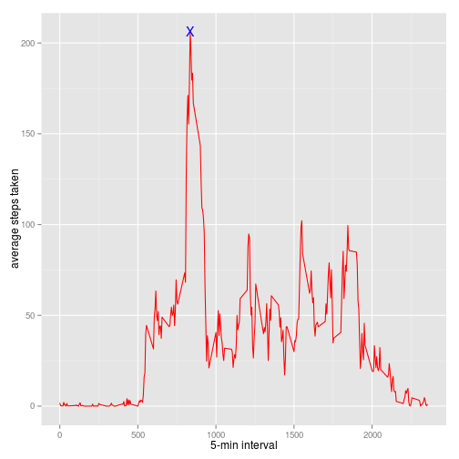

### Some Preparation
+ Identify R Working folder.    
    R markdown packages use its own working folder which may differ from the console's.  
    Identify the current folder is thus necessary to begin with.
    The current R Markdown working folder is: **[/home/quan/RepRes_ProjectAssignment1]**.

+ Unzip the compressed data into working folder.

```r
    unzip(zipfile = "~/Downloads/repdata-data-activity.zip", exdir = "~/RepRes_ProjectAssignment1/")
```
    
+ The data is then read into memory.

```r
    my.data <- read.csv(file="activity.csv", header=TRUE, sep=",", na.string="NA")
```

### What is mean total number of steps taken per day?
1. Calculate the total number of steps taken per day.
+ `date` has been switched to Date class.
    By changing the class of `date` column, it also becomes continuous "data" instead of "factor". This will affect the ggplot figure.
+ The `steps` data are taking `mean()` and `median()`.
    according to `date` by `aggregate()` method with `FUN=mean` specified.
    `NA` values are treated by `na.action = na.omit` at this stage.

```r
    my.data$date <- as.Date(my.data$date)
    my.data.aveSteps <- aggregate(formula = steps ~ date,  data = my.data, FUN = mean, na.action = na.omit)
```

2. Calculate and report the mean and median of the total number of steps taken per day
+ Calculate the mean of daily steps.

```r
    DailySteps.mean <- mean(my.data.aveSteps$steps)
    DailySteps.median <- median(my.data.aveSteps$steps)
```

```r
    DailySteps.mean
```

```
## [1] 37.3826
```

```r
    DailySteps.median
```

```
## [1] 37.37847
```
+ Result    
  The daily step mean is 37.3825996 and the daily step median is 37.3784722.

3. Make a histogram of the total number of steps taken each day.
+ Put up a figure showing the daily steps.    
I need to set up my locale to English by using `Sys.setlocale()`, as it would otherwise display Chinese figure legends in my computer. Ubuntu knows where I am.    
Then comes the ggplot *per se*. Mean of daily steps in **red** dash line and median of daily steps in **blue** line. 

```r
    Sys.setlocale("LC_ALL", 'en_GB.UTF-8')
```


```r
    require(ggplot2)    
```

```
## Loading required package: ggplot2
```

```r
    ggplot(data=my.data.aveSteps, aes(x=date, y=steps)) +
        geom_histogram(stat="identity", fill="lightblue", colour="black") +
        geom_hline(yintercept=DailySteps.mean+0.5, linetype="dashed", colour="red") +    
        geom_hline(yintercept=DailySteps.median-0.5, linetype="dotted", colour="blue") +
        xlab("date") +
        ylab("steps taken")
```

 


### What is the average daily activity pattern?
1. Make a time series plot (i.e. type = "l") of the 5-minute interval (x-axis) and the average number of steps taken, averaged across all days (y-axis)
+ First, calcuate average interval steps taken.

```r
    my.data.aveIntervalSteps <- aggregate(formula = steps ~ interval, data = my.data, FUN = mean)
    my.data.maxIntervalSteps <- my.data.aveIntervalSteps[which.max(my.data.aveIntervalSteps$steps),]
```

+ then produce the figure showing time series plot.

```r
    require(ggplot2)    ## not quite necessary but as a good habit.
    ggplot(data=my.data.aveIntervalSteps, aes(x=interval, y=steps)) +
          geom_line(colour="red", size=0.5) +
          geom_point(data=my.data.maxIntervalSteps, aes(x=interval, y=steps), colour="blue", shape="X", size=5) +
          xlab("5-min interval") +
          ylab("average steps taken")
```

 

2. Which 5-minute interval, on average across all the days in the dataset, contains the maximum number of steps?
+ Showing the interval with maximum mean steps.    

```r
    my.data.maxIntervalSteps
```

```
##     interval    steps
## 104      835 206.1698
```

+ Result    
It is thus revealed that the 104th interval at 835 minute of the day has the highest average step of 206.1698113 steps.

### Imputing missing values
1. Calculate and report the total number of missing values in the dataset (i.e. the total number of rows with NAs).
+ Set up counting the `NA` values in dataset. 

```r
my.data.NA <- is.na(my.data$steps)
summary(my.data.NA)
```

```
##    Mode   FALSE    TRUE    NA's 
## logical   15264    2304       0
```

+ Result    
The dataset is thus with 2304 missing values.

2. Devise a strategy for filling in all of the missing values in the dataset. The strategy does not need to be sophisticated. For example, you could use the mean/median for that day, or the mean for that 5-minute interval, etc.
+ Fill `NA` values with `my.data.aveIntervalSteps` which is the 5-min average.

```r
my.data.sansNA <- my.data
for (index in 1:nrow(my.data.sansNA)){
    if(is.na(my.data.sansNA$steps[index])){
       my.data.sansNA$steps[index]<- my.data.aveIntervalSteps$steps[my.data.aveIntervalSteps$interval == my.data.sansNA$interval[index]]
    }
}
```

3. Create a new dataset that is equal to the original dataset but with the missing data filled in.
+ This is done. The summary of data is shown here.

```r
str(my.data.sansNA)
```

```
## 'data.frame':	17568 obs. of  3 variables:
##  $ steps   : num  1.717 0.3396 0.1321 0.1509 0.0755 ...
##  $ date    : Date, format: "2012-10-01" "2012-10-01" ...
##  $ interval: int  0 5 10 15 20 25 30 35 40 45 ...
```

4. Make a histogram of the total number of steps taken each day and Calculate and report the mean and median total number of steps taken per day. Do these values differ from the estimates from the first part of the assignment? What is the impact of imputing missing data on the estimates of the total daily number of steps?
+ First, the mean and median of total number of steps.

```r
    my.data.sansNA.aveSteps <- aggregate(formula = steps ~ date,  data = my.data.sansNA, FUN = mean)
    DailySteps.mean.sansNA <- mean(my.data.sansNA.aveSteps$steps)
    DailySteps.median.sansNA <- median(my.data.sansNA.aveSteps$steps)
```

```r
    DailySteps.mean.sansNA
```

```
## [1] 37.3826
```

```r
    DailySteps.median.sansNA
```

```
## [1] 37.3826
```

+ histogram of the total number of steps.

```r
    require(ggplot2)    
    ggplot(data=my.data.sansNA.aveSteps, aes(x=date, y=steps)) +
        geom_histogram(stat="identity", fill="lightblue", colour="black") +
        geom_hline(yintercept=DailySteps.mean, linetype="dashed", colour="red") +    
        geom_hline(yintercept=DailySteps.median, linetype="dotted", colour="blue") +
        xlab("date") +
        ylab("steps taken")
```

 

+ Result    
By replacing the NA values with 5-minute interval average, the average of totoal number of steps per day is **not** evidently altered as the missing values are lost at a whole day basis. The `aggregate()` method I use to calculate the mean omits these `NA` values at whole day basis. Thus, replacing these values with the average value of these days has no impact on the final calculation of average. The median value has been increased as the 'middle number' naturally shifts near the mean with more numbers equal to the mean joined the queue. In the histogram, **mean** and **median** overlap. 

### Are there differences in activity patterns between weekdays and weekends?
1. Create a new factor variable in the dataset with two levels – “weekday” and “weekend” indicating whether a given date is a weekday or weekend day.
+ Build a function `is.weekday()` to identify weekday property of `Date` class data.

```r
is.weekday <- function(date) {
  day.test <- weekdays(date)
  if (day.test %in% c("Monday", "Tuesday", "Wednesday", "Thursday", "Friday"))
    return("weekday")
  else if (day.test %in% c("Saturday", "Sunday"))
    return("weekend")
  else
    stop("illegal tester")
}        ## remember that $date column is already a "Date" class data column.
```

+ Apply `is.weekday()` function of the newly built `NA` free dataset.

```r
my.data.sansNA$wday <- sapply(my.data.sansNA$date, FUN=is.weekday)    
str(my.data.sansNA)
```

```
## 'data.frame':	17568 obs. of  4 variables:
##  $ steps   : num  1.717 0.3396 0.1321 0.1509 0.0755 ...
##  $ date    : Date, format: "2012-10-01" "2012-10-01" ...
##  $ interval: int  0 5 10 15 20 25 30 35 40 45 ...
##  $ wday    : chr  "weekday" "weekday" "weekday" "weekday" ...
```

2. Make a panel plot containing a time series plot (i.e. type = "l") of the 5-minute interval (x-axis) and the average number of steps taken, averaged across all weekday days or weekend days (y-axis). See the README file in the GitHub repository to see an example of what this plot should look like using simulated data.
+ Generate the average among weekdays and weekends.

```r
    my.data.wday.aveIntervalSteps <- aggregate(formula = steps ~ interval + wday, data = my.data.sansNA, FUN = mean)
```

+ Plot average steps against time interval with weekdays and weekends split.

```r
    require(ggplot2)
    ggplot(data=my.data.wday.aveIntervalSteps, aes(x=interval, y=steps)) +
        facet_grid(wday ~ . ) +
        geom_line(colour="red", size=0.5) +
        ## geom_point(colour="blue", shape="X", size=1) +      ## data points can be optionally shown
        xlab("5-min interval") +
        ylab("average steps taken")
```

 

+ Result    
There is evident difference between `weekday` and `weekend` activity patterns.
It seems that the person being measured gets up later in weekend and subsequently walk less in weekend morning.
